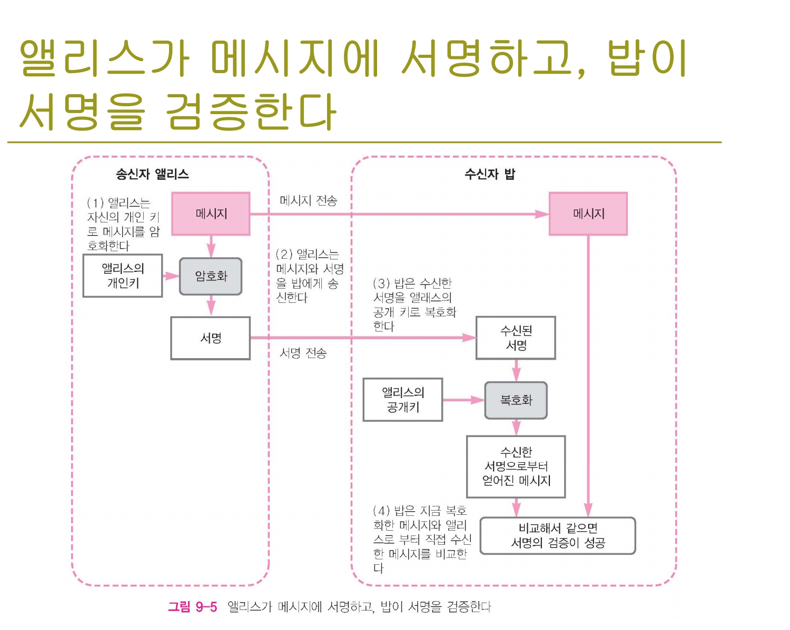
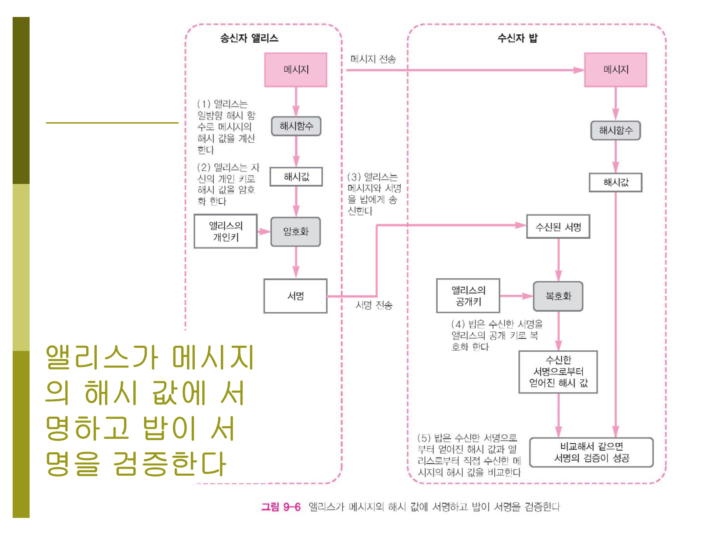

# Security
## Encryption and signing
*  cryptography - 사용되는 키의 보안성과 직결됨

### Symmetric-key encryption
* 대칭 암호화: 암호화에 사용되는 키를 가지고 있는 서버가 해킹당하면 이 키를 공유하는 모든 서버가 안전하지 않다. 또한, 키를 변경할 때마다 여러 서버에 변경을 적용해줘야 하기 때문에 관리하기가 힘들다.

### Public-key cryptography
* 비대칭 암호화
	* public key: 암호화에 사용, 공개되어 공유됨
	* secret key: 복호화에 사용

[RSA 인증서 (Certification) 와 전자서명 (Digital Sign)의 원리 - RSEC.KR](https://rsec.kr/?p=426)
> 일반적으로 한쌍의 암호화 키 중 하나는 공개키, 다른 하나는 비밀키로써 공개키는 암호화에 쓰이고 비밀키는 복호화에 쓰여진다고 알려져 있으나 이는 잘못된 이해입니다. 비밀키로 암호화 된 것을 공개키로 복호화 하여 볼 수도 있고, 마찬가지로 공개키로 암호화 된 것을 비밀키로 풀어서 볼 수도 있습니다. 	

### Digital signatures
* public-key 암호화를 통해 전자 서명이 가능하다.
	* 보통, 효율성을 위해 메세지를 단방향 hash한 후, 개인키를 통해 암호화하는 방식을 사용한다. 메세지를 전송받은 수신자가, 메세지의 해쉬갑과 공개키를 통한 복호화 값을 비교하여 검증할 수 있다.
* [디지털 서명 참고자료](http://www.parkjonghyuk.net/lecture/modernCrypto/lecturenote/chap09.pdf)

### X.509 digital certificates
* man-in-the-middle attack: 공개키가 공유되는 과정에서 악의적인 3자로 인해, 잘못된 공개키를 사용하여 암호화하는 경우를 막기 위해 `전자 인증`이 존재한다.
-> 자신이 입수한 공개 키가 바른 공개 키인지 어떤 지를 검증하기 위해서 공개 키를 메시지로 간주하고 그것에 신뢰할 수 있는 제 3자가 디지털 서명을 한다.
* 전자인증(digital certificate)의 구성 
	* public key
	* 보유자의 이름이나 ID와 같은 인증 정보
	* 1개 이상의 전자서명
* Certificate Authority(CA)의 디지털 서명을 공개키에 붙인다. 다음과 같은 서비스가 유명하다.
	* Comodo
	* Symantec(=Verisign)
	* GoDaddy
* 브라우저 상에 HTTPS 통신으로 인증받는 것은 이러한 CA를 브라우저단에서 확인한 것이다.

### TLS/SSL
* SSL: POODLE 공객에 취약, (SSL기반으로 업그레이드된) TLS1.0 이상으로 대체해야 한다.
* TLS
	* 대칭 암호화 방법을 사용한다.
	* 하지만, handshake 과정의 첫 스텝에서 비대칭 암호화를 적용한다.

## External security
### Layer 2 or 3 firewalls
* Layer 2: 보통 routing에 사용, IP address가 아닌 MAC address와 관련
* Layer 3: IP와 관련
* Edge firewall: 시스템의 entrypoint, 최근에는 보통 Layer3에 있다.
* 역할: 원치 않는 트래픽을 막고, 특정 포트에 대한 접근을 IP 별로 제한할 수 있다.
	* 참고: AWS의  inbound 관리
* SSH 접속권한 등을 제한해서 Buffer overrun attack 등을 막을 수 있다.

### Web application firewall
* 웹에 특화된 Layer 7 방화벽 - 일종의 reverse proxy로 생각할 수 있다.
* OWASP 기반으로 적용된 차단룰을 바탕으로 방어
	* cross-site scripting(XSS)
	* SQL injection 등
* 최소한 ModSecurity(오픈소스)와 OWASP CRS(core rule set)를 WAF로 적용할 것
* 도커 컨테이너 내에서 사용하는 것은 어렵지 않으며, Layer 2 방화벽 뒤의 `제 2의 보안막`으로 사용해야 한다.
* cloudflare와 같은 CDN 회사도 WAF를 제공한다.

### API gateway
* 참고:
	* [조대협의 블로그 :: MSA 아키텍쳐 구현을 위한 API 게이트웨이의 이해 (API GATEWAY)](http://bcho.tistory.com/1005)
	* [Program Development :: API 게이트웨이의 이해 및 구현1](http://jodu.tistory.com/17)
* (많은 기능 중) 중요한 목적
	* API 호출을 해당 서비스로 라우팅(=엔드포인트별 API 호출 인증)
	* edge에서 token validation(=인증 및 허가)
	* 부가적으로, input validation & transformation 등등
* 인증 및 허가의 예
	* 백엔드의 여러 서비스에서 각각 웹 토큰을 복호화하기 위한 private key를 가지고 있을 필요없이, 단일 API gateway에서 해당 logic을 처리하다록 구현
* API gateway의 기능
	* request validation
	* authorization
	* rate limiting
	* logging
	* caching
	* request and response transformation 등등
* (Nginx를 통해 직접 구현할 수 도 있지만) AWS에도 API gateway 사용하는 것을 추천

### DDos protection(의 종류들)

	* UDP frament: 네트워크 별 설정된 maximum transmission unit을 초과한 data 전송
	* UDP flood: 가짜 IP에서 발송된 UPD packet을 전송
	* DNS: DNS server에 많은 쿼리를 전송
	* NTP: 업데이트 안된 NTP서버들 공격
	* Chargen: 네트워크 상의 프린터에 사용되는 Chargen 서버들 공격
	* SYN flood: 커넥션이 닫히지 못하도록 많은 패킷을 전송
	* SSDP: 홈 라우터에 사용된는 프로토콜
	* ACK: 3-way handshake 과정에서 사용

1. DDos 공격을 막기 위해, 적절한 firewall과 업데이트를 해줘야 한다.
2. 또한 cloudflare와 같은 서비스를 이용하는 것도 방법이다.
 
